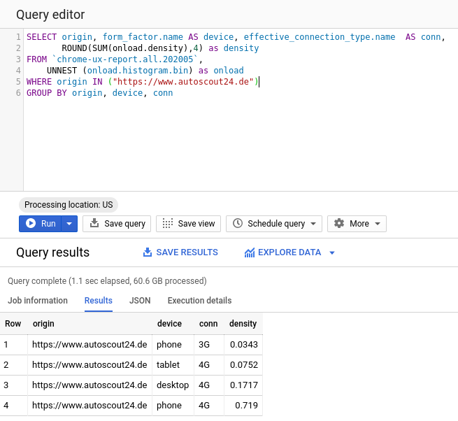

# Chrome User Experience Report

#### Adam Beres-Deak

##### Lead Engineer @ UES Convert Web

--

--

# Core Web Vitals

It will be a ranking factor in 2021

--

# Chrome UX Report

> The Chrome User Experience Report provides user experience metrics for how real-world Chrome users experience popular destinations on the web.

--

## Metrics

- First contentful paint
- DOMContentLoaded
- onload
- First Input Delay
- Cumulative Layout Shift
- Time to First Byte
- Notification Permissions
- Effective Connection Type
- Device Type
- Country

--

# CrUX is a public BigQuery Project

--

--

--

# Resources

- https://web.dev/vitals/
- https://developers.google.com/speed/docs/insights/v5/about
- https://developers.google.com/speed/pagespeed/insights/?hl=en&url=http%3A%2F%2Fwww.autoscout24.de%2F
- https://web.dev/chrome-ux-report-bigquery/
- https://developers.google.com/web/tools/chrome-user-experience-report
